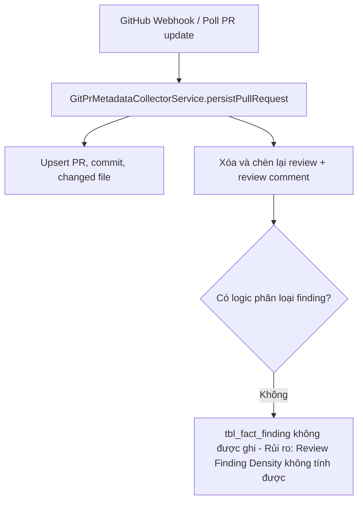
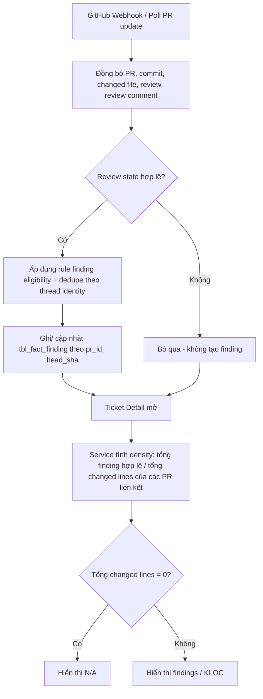
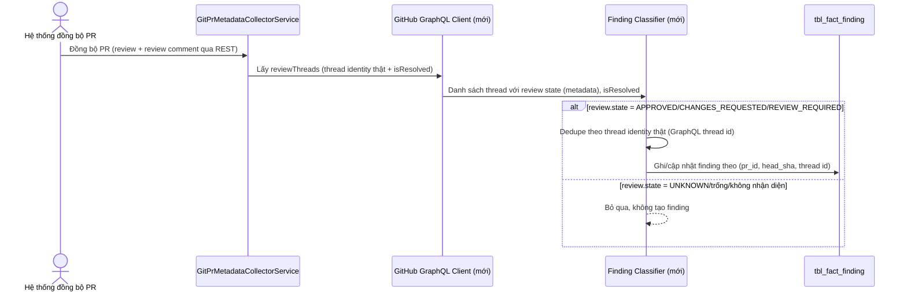
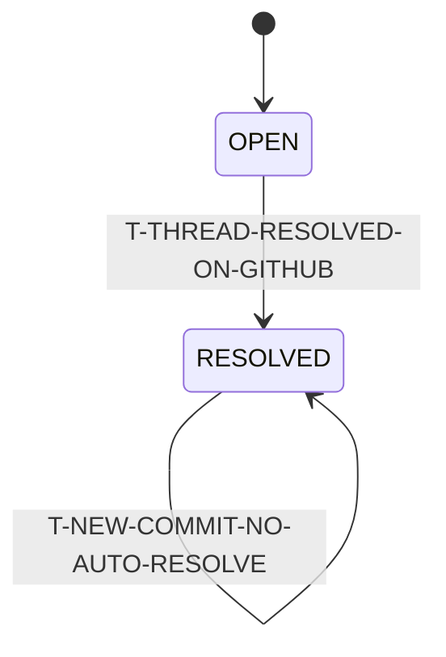
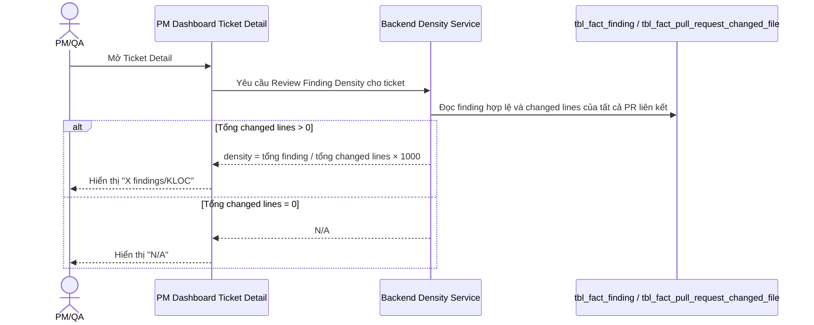
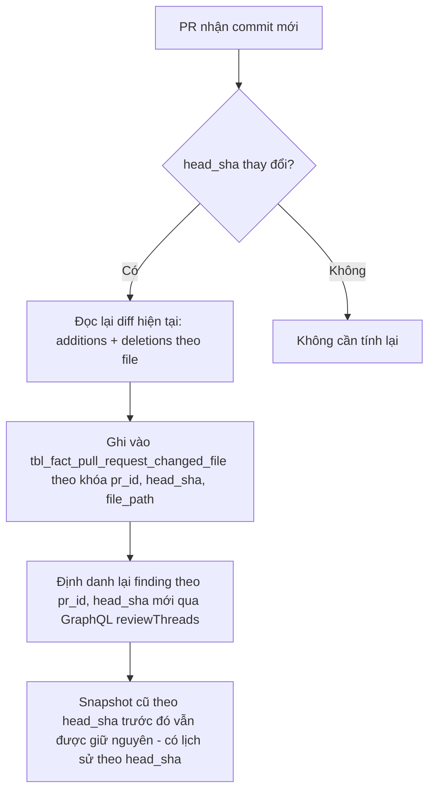

# Gói đặc tả — REVIEW-FINDING-DENSITY (Review Finding Density)

- **Ticket:** REVIEW-FINDING-DENSITY
- **Trạng thái:** Draft
- **Tạo ngày:** 2026-09-10 15:01:25
- **Cập nhật ngày:** 2026-09-10 (Tất cả Open Issues P0/P1/P2 đã chốt)

> **Nguồn tham chiếu duy nhất cho thay đổi này sau khi được review và các Open Issues P0 được chốt.**
> Không triển khai bất kỳ nội dung nào không được viết ở đây. Các điểm chưa rõ phải được xử lý như Open Issues.

---

## 1. Bối cảnh / Mục đích

Ticket `REVIEW-FINDING-DENSITY` đặc tả chỉ số **Review Finding Density** hiển thị trên màn hình chi tiết ticket của PM Dashboard, theo mô hình:

**Hệ thống đọc dữ liệu review/finding và changed-lines của các Pull Request liên kết với một ticket, tính tỉ lệ `tổng review finding hợp lệ / tổng changed lines × 1.000`, và hiển thị kết quả dưới đơn vị `findings / KLOC` khi mở Ticket Detail.**

Mục đích nghiệp vụ:

- Đo mật độ finding do human reviewer phát hiện tương ứng với quy mô thay đổi của PR, giúp PM/QA/engineering đánh giá chất lượng review độc lập với kích thước PR.
- Nguồn xác thực duy nhất cho finding là GitHub PR review thread/comment do human reviewer tạo (không dùng `tbl_fact_ai_finding_stat`, vốn là KPI riêng cho AI review).
- Trải nghiệm kỳ vọng: khi mở Ticket Detail, chỉ số hiển thị ngay từ dữ liệu đã lưu/tính từ dữ liệu runtime hiện có; nếu tổng changed lines bằng 0, hiển thị `N/A` thay vì `0`.
- Khi PR liên kết có commit mới, hệ thống phải đọc lại diff hiện tại (`additions + deletions` theo `head_sha` mới nhất) và định danh lại finding theo phiên bản mới, tránh cộng dồn sai giữa các phiên bản.
- Trạng thái finding (`OPEN`/`RESOLVED`) phải truy vết được để phục vụ breakdown, dù không ảnh hưởng tổng density.
- Ràng buộc "không triển khai ngầm các hành vi chưa phê duyệt": không được tự suy diễn cách lấy trạng thái resolved của GitHub review thread hay cách phân loại finding khi phần này chưa có flow hoàn chỉnh trong hệ thống — các điểm đó phải là Open Issues.

**Quyết định đã chốt (P0):**

- `OI-REVIEW-FINDING-DENSITY-001`: Dùng **GitHub GraphQL** (`reviewThreads`, `isResolved`) làm nguồn xác định thread identity và resolved-status thật, thay vì REST-only heuristic. Cần bổ sung GraphQL client mới cho GitHub adapter.
- `OI-REVIEW-FINDING-DENSITY-002`: Bổ sung cột `head_sha` vào `tbl_fact_pull_request_changed_file` và đổi khóa lưu trữ thành `(pr_id, head_sha, file_path)`, thay cho khóa hiện tại `(pr_id, file_path_hash)`, để hỗ trợ tính lại changed-lines đúng theo từng phiên bản PR và không trộn dữ liệu giữa các `head_sha`.
- `OI-REVIEW-FINDING-DENSITY-003`: Xác định finding **chỉ dựa trên metadata** (review state hợp lệ sau chuẩn hóa: `APPROVED`, `CHANGES_REQUESTED` hoặc `REVIEW_REQUIRED`, và thread tồn tại qua GraphQL `reviewThreads`) — **không dùng NLP** để suy đoán ý nghĩa nội dung comment.
- `OI-REVIEW-FINDING-DENSITY-004`: Giá trị density hiển thị được làm tròn **1 chữ số thập phân**, dùng `RoundingMode.HALF_UP`.

## 2. Phạm vi

### 2.1 Trong phạm vi

- Định nghĩa rule xác định một review thread có được tính là finding hay không, **chỉ dựa trên metadata** (review state hợp lệ sau chuẩn hóa + thread tồn tại qua GraphQL `reviewThreads`; loại `UNKNOWN`, trống và state không nhận diện) — không dùng NLP/phân tích ngữ nghĩa nội dung comment.
- Định nghĩa rule dedupe: dùng GitHub GraphQL `reviewThreads` làm nguồn thread identity thật; một review hợp lệ có nhiều thread → mỗi thread tính một finding; nhiều comment cùng thread → gộp thành một finding.
- Sử dụng GitHub GraphQL (`reviewThreads`, `isResolved`) làm nguồn xác định thread identity và trạng thái resolved thật của review thread.
- Định nghĩa công thức changed lines (`additions + deletions` từ diff hiện tại của PR theo `head_sha`, không cộng dồn theo từng commit).
- Định nghĩa công thức density cho một PR và cho ticket có nhiều PR liên kết (tổng finding / tổng changed lines, không lấy trung bình per-PR).
- Định nghĩa rule hiển thị `N/A` khi tổng changed lines = 0.
- Định nghĩa rule cập nhật khi PR có commit mới: đọc lại diff, định danh lại finding, dùng `(pr_id, head_sha, file_path)` làm khóa lưu changed-lines để tránh trộn dữ liệu giữa các phiên bản.
- Bổ sung cột `head_sha` vào `tbl_fact_pull_request_changed_file` ở mức nghiệp vụ (khóa dữ liệu `(pr_id, head_sha, file_path)`); chi tiết migration SQL thuộc Phase 2.
- Định nghĩa breakdown theo trạng thái finding (`OPEN`/`RESOLVED`) để hiển thị bổ sung trên Ticket Detail.
- Xác định các bảng dữ liệu nghiệp vụ cần đọc/ghi (`tbl_fact_review`, `tbl_fact_review_comment`, `tbl_fact_finding`, `tbl_fact_pull_request_changed_file`) ở mức nghiệp vụ, không đóng chi tiết schema vật lý mới ngoài thay đổi khóa đã chốt ở trên.

### 2.2 Ngoài phạm vi

- Chi tiết implementation: package/class Java cụ thể, tên GraphQL query cụ thể, chi tiết migration SQL cụ thể — các quyết định đó thuộc Phase 2 (impl-plan), không đóng ở đây.
- Việc dùng `tbl_fact_ai_finding_stat` hoặc bất kỳ AI-finding KPI nào (AI Review Adoption, AI Valid Finding Rate, AI False Positive Rate, AI Finding Resolution Rate) làm nguồn cho Review Finding Density.
- Ranking cá nhân reviewer hoặc đánh giá hiệu suất cá nhân dựa trên density.
- Redesign toàn bộ màn hình PM Dashboard Ticket Detail — chỉ thêm chỉ số vào màn hình hiện có.

## 3. Thuật ngữ

| #   | Thuật ngữ                | Định nghĩa |
| --- | ------------------------- | --------- |
| 1   | Review Finding Density     | `tổng review finding hợp lệ / tổng changed lines × 1.000`, đơn vị `findings / KLOC` |
| 2   | Finding                     | Một review thread (theo GraphQL `reviewThreads`) do human reviewer tạo, thuộc review có state hợp lệ sau chuẩn hóa (`APPROVED`, `CHANGES_REQUESTED`, `REVIEW_REQUIRED`); xác định bằng metadata, không dùng NLP |
| 3   | Changed lines               | `additions + deletions` của PR tính theo diff hiện tại (`head_sha` hoặc commit cuối) |
| 4   | Human reviewer              | Actor tạo review/comment không phải AI review bot (phân biệt qua `source_actor_type_id`/`actor_type_id`) |
| 5   | Thread identity              | Định danh dùng để dedupe nhiều comment về cùng một finding (ví dụ theo file + vị trí dòng trong cùng một review) |
| 6   | `head_sha`                  | SHA của commit cuối cùng hiện tại của PR, dùng để định danh phiên bản diff/finding |
| 7   | Snapshot                    | Dữ liệu changed-lines/finding được tính lại và lưu ứng với một `head_sha` cụ thể |

| Khái niệm            | Trả lời câu hỏi                                              | Tác dụng |
| --------------------- | ------------------------------------------------------------- | -------- |
| Finding eligibility   | "Thread nào được tính là finding?"                              | Metadata-only: mọi thread thuộc review có state hợp lệ được tính; `UNKNOWN`/trống bị loại; không lọc theo nội dung câu chữ |
| Multi-PR aggregation  | "Ticket có nhiều PR thì tính density thế nào?"                  | Đảm bảo không lấy trung bình sai (per-PR average) làm méo kết quả |
| N/A rule              | "Changed lines = 0 thì hiển thị gì?"                            | Tránh hiểu nhầm "density = 0" nghĩa là không có finding |
| Recalculation on push | "Có commit mới thì finding/changed-lines cũ còn hợp lệ không?" | Đảm bảo số liệu luôn phản ánh phiên bản PR hiện tại |

## 4. Hiện trạng / Trạng thái mục tiêu

| #   | Khía cạnh                              | Hiện trạng                                                                                  | Trạng thái mục tiêu |
| --- | ---------------------------------------- | --------------------------------------------------------------------------------------------- | ---------------------- |
| 1   | Bảng dữ liệu finding/review               | `tbl_fact_review`, `tbl_fact_review_comment`, `tbl_fact_finding` đã tồn tại (V4, dòng 570-631) | Giữ nguyên, không cần bảng mới cho MVP tính toán |
| 2   | Flow phân loại finding                    | Không có code nào ghi vào `tbl_fact_finding`                                                    | Cần flow phân loại review thread thuộc state hợp lệ → finding |
| 3   | Changed lines                             | `tbl_fact_pull_request_changed_file` (V181) đã có `additions`/`deletions`, upsert theo `(pr_id, file_path_hash)`, không có `head_sha` | **Đã chốt:** bổ sung cột `head_sha`, đổi khóa lưu trữ thành `(pr_id, head_sha, file_path)` |
| 4   | Resolved-status của GitHub thread          | GitHub REST không có khái niệm thread/`isResolved`; adapter hiện tại chỉ gọi REST `/reviews`, `/comments` | **Đã chốt:** bổ sung GitHub GraphQL client để lấy `reviewThreads`/`isResolved` |
| 5   | Tính density                              | Chưa có bất kỳ logic tính density/KLOC nào trong hệ thống                                        | Cần service tính density theo công thức đã định nghĩa ở mục 5.3 |
| 6   | Hiển thị trên Ticket Detail                | PM Dashboard Ticket Detail chưa có chỉ số này                                                    | Thêm hiển thị `findings / KLOC` hoặc `N/A` vào màn hình hiện có |

### 4.1 Cơ chế hiện tại

**Mô tả:** `GitPrMetadataCollectorService.persistPullRequest` hiện đã upsert PR, commit, changed file (`tbl_fact_pull_request_changed_file`), và xóa-rồi-chèn lại toàn bộ review/review comment (`tbl_fact_review`, `tbl_fact_review_comment`) mỗi lần đồng bộ PR, với `review_state` được chuẩn hóa thành `APPROVED | CHANGES_REQUESTED | REVIEW_REQUIRED | UNKNOWN`. Tuy nhiên không có bước nào phân loại review comment thành finding và ghi vào `tbl_fact_finding`; bảng này hiện trống về mặt luồng ghi dữ liệu. Rủi ro nghiệp vụ: Review Finding Density không thể tính được từ dữ liệu runtime hiện tại vì thiếu cả finding classification lẫn resolved-status của GitHub thread.



### 4.2 Cải tiến thêm lần này

**Mô tả:** Bổ sung một bước phân loại sau khi review/review comment được đồng bộ: mọi review có state hợp lệ sau chuẩn hóa được xét theo rule ở mục 5.1, các thread hợp lệ được ghi thành finding (dedupe theo thread identity), sau đó một service tính density đọc `tbl_fact_finding` + `tbl_fact_pull_request_changed_file` của các PR liên kết ticket để trả về giá trị hiển thị trên Ticket Detail. Nguyên tắc chính thay đổi so với 4.1: finding classification và density calculation trở thành bước bắt buộc sau khi đồng bộ PR, thay vì chỉ dừng ở lưu review/comment thô.



## 5. Chi tiết đặc tả

**Index các sub-section + AC tra cứu:**

| #   | Chủ đề                              | Giải thích chức năng                                                        | Câu hỏi nghiệp vụ                                     | AC liên quan            | Transitions liên quan |
| --- | -------------------------------------- | ------------------------------------------------------------------------------ | -------------------------------------------------------- | ------------------------- | ----------------------- |
| 5.1 | Finding eligibility & classification    | Xác định review thread/comment nào được tính là finding                          | Comment nào được/không được tính?                          | `AC-FINDING-CLASSIFY-*`   | `T-FINDING-*`           |
| 5.2 | State transitions                       | Vòng đời trạng thái finding và ảnh hưởng lên density                              | Trạng thái finding có ảnh hưởng tổng density không?         | AC theo từng transition   | Tất cả                  |
| 5.3 | Changed lines & density calculation     | Công thức changed lines, công thức density cho 1 PR và nhiều PR, rule N/A         | Ticket có nhiều PR thì tính density thế nào? 0 dòng thì sao? | `AC-DENSITY-CALC-*`       | `T-DENSITY-*`           |
| 5.4 | Recalculation khi có commit mới          | Đọc lại diff, định danh lại finding theo `head_sha` mới                          | Có commit mới thì số liệu cũ có còn dùng được không?        | `AC-RECALC-*`             | `T-RECALC-*`            |
| 5.X | Dữ liệu nghiệp vụ và audit               | Các nhóm dữ liệu cần có để kiểm thử, không đóng schema vật lý                    | Cần trường nghiệp vụ nào để trace được finding?             | Tất cả AC ở trên          | Tất cả                  |

### 5.1 Finding eligibility & classification

**Mục tiêu:** Định nghĩa rule xác định một review thread GitHub có được tính là một finding hợp lệ hay không, và cách dedupe nhiều comment về cùng một finding. Rule chỉ dựa trên metadata (review state, sự tồn tại của thread) — **không dùng NLP** để đọc hiểu nội dung comment nhằm suy đoán LGTM/ACK/câu hỏi.

**UI/Wireframe:** N/A — đây là logic BE thuần túy, không có màn hình riêng.

| Vùng | Tên | Trace |
| ----------- | --------- | --------- |
| N/A | Không có UI riêng cho bước phân loại | `AC-FINDING-CLASSIFY-1` |

**UI states cần thiết kế:**

| #   | State | Ghi chú |
| --- | --------- | ----------- |
| N/A | Không áp dụng | Bước xử lý BE nội bộ |

**Message lỗi cần xử lý:**

| Tình huống | Message nghiệp vụ |
| -------------- | ----------------- |
| Review data không đọc được từ GitHub | "Không thể phân loại finding do dữ liệu review không khả dụng" (log/telemetry nội bộ, không nhất thiết hiển thị FE) |

**Luồng end-to-end:**



**Ví dụ:**

- **Happy:** Review có state hợp lệ và 3 thread → 3 finding được ghi, mỗi thread một finding dù có nhiều comment qua lại trong cùng thread (thread identity lấy từ GraphQL).
- **Edge:** Thread dưới review `APPROVED`/`REVIEW_REQUIRED` hoặc `CHANGES_REQUESTED` mà nội dung chỉ là câu hỏi làm rõ → thread đó **vẫn được tính là finding**, vì rule chỉ xét metadata và không phân tích nội dung câu chữ.
- **Error:** Review `UNKNOWN`, trống hoặc state không nhận diện → không được tính là finding.

**OI:** Không còn OI chặn — tiêu chí đã chốt: metadata-only (`OI-REVIEW-FINDING-DENSITY-003`, Closed).

### 5.2 State transitions

**Mục tiêu:** Mô tả vòng đời trạng thái của một finding và xác nhận trạng thái không làm thay đổi tổng density, chỉ phục vụ breakdown.

**State diagram:**



**Bảng state × thuộc tính:**

| State | Mô tả | Tính vào tổng density? | Hiển thị breakdown? | Transitions hợp lệ |
| --------- | --------- | ----------------- | ----------------- | ------------------ |
| OPEN | Finding mới phát hiện, chưa xử lý | Có | Có | `T-THREAD-RESOLVED-ON-GITHUB` |
| RESOLVED | Thread đã resolve trên GitHub | Có | Có | `T-NEW-COMMIT-NO-AUTO-RESOLVE` |

**Bảng state transition:**

| #   | ID | Sự kiện | Mode áp dụng | Hệ quả bắt buộc | Trace |
| --- | --------- | ----------- | ------------ | --------------- | --------- |
| 1   | `T-THREAD-RESOLVED-ON-GITHUB` | GitHub review thread được resolve (đọc qua GraphQL `isResolved`) | Tự động khi đồng bộ | Chuyển finding từ `OPEN` sang `RESOLVED` | `AC-STATUS-1` |
| 5   | `T-NEW-COMMIT-NO-AUTO-RESOLVE` | PR có commit mới | Tự động khi đồng bộ | Không tự chuyển trạng thái finding cũ sang `RESOLVED` chỉ vì có commit mới | `AC-STATUS-5` |

**UI/Wireframe:** N/A.

**Ví dụ:** N/A; xem 5.1 và 5.4 cho các luồng gọi transition tương ứng.

**OI:** Không còn OI chặn — nguồn cho `T-THREAD-RESOLVED-ON-GITHUB` đã chốt dùng GitHub GraphQL (`OI-REVIEW-FINDING-DENSITY-001`, Closed).

### 5.3 Changed lines & density calculation

**Mục tiêu:** Định nghĩa công thức changed lines, công thức density cho một PR và cho ticket có nhiều PR liên kết, và rule hiển thị `N/A`.

**UI/Wireframe:**

```text
+-------------------------------------------+
| Ticket Detail                              |
|  ...                                       |
|  Review Finding Density: 12.4 findings/KLOC|
|  (hoặc: Review Finding Density: N/A)       |
|  Breakdown: OPEN 5 · RESOLVED 6 ·           |
+-------------------------------------------+
```

| Vùng | Tên | Trace |
| ----------- | --------- | --------- |
| Chỉ số chính | Giá trị `findings / KLOC` hoặc `N/A` | `AC-DENSITY-CALC-1`, `AC-DENSITY-CALC-4` |
| Breakdown | Số finding theo trạng thái `OPEN`/`RESOLVED` | `AC-DENSITY-CALC-5` |

**UI states cần thiết kế:**

| #   | State | Ghi chú |
| --- | --------- | ----------- |
| 1   | Có giá trị số | Làm tròn 1 chữ số thập phân, dùng `RoundingMode.HALF_UP` (đã chốt, `OI-REVIEW-FINDING-DENSITY-004`, Closed) |
| 2   | `N/A` | Khi tổng changed lines của các PR liên kết = 0 |

**Message lỗi cần xử lý:**

| Tình huống | Message nghiệp vụ |
| -------------- | ----------------- |
| Tổng changed lines = 0 | "N/A" (không hiển thị "0") |
| Ticket chưa có PR liên kết | "N/A" (không có dữ liệu để tính) |

**Luồng end-to-end:**



**Ví dụ:**

- **Happy:** Ticket có 2 PR liên kết: PR1 có 3 finding hợp lệ và 500 changed lines, PR2 có 2 finding hợp lệ và 500 changed lines → density = (3+2) / (500+500) × 1000 = 5 findings/KLOC. Không tính trung bình của (3/500×1000 + 2/500×1000)/2.
- **Edge:** Ticket chỉ có 1 PR với 0 finding và 200 changed lines → density = 0 findings/KLOC (giá trị 0 hợp lệ, khác với trường hợp N/A vì changed lines > 0).
- **Error:** Ticket có PR nhưng tổng changed lines = 0 (ví dụ PR chỉ đổi file binary không tính dòng) → hiển thị `N/A`, không hiển thị `0`.

**OI:** Không còn OI chặn — versioning theo `head_sha` đã chốt: `tbl_fact_pull_request_changed_file` bổ sung cột `head_sha`, khóa `(pr_id, head_sha, file_path)` (`OI-REVIEW-FINDING-DENSITY-002`, Closed).

### 5.4 Recalculation khi PR có commit mới

**Mục tiêu:** Đảm bảo khi PR liên kết có commit mới, hệ thống đọc lại diff hiện tại và định danh lại finding theo phiên bản mới, tránh cộng dồn sai giữa các `head_sha`.

**UI/Wireframe:** N/A — đây là luồng đồng bộ nền, không có màn hình riêng.

**Flow:**



**UI states cần thiết kế:**

| #   | State | Ghi chú |
| --- | --------- | ----------- |
| 1   | Đang tính lại | Không bắt buộc hiển thị loading riêng nếu tính đồng bộ nền, cần xác nhận ở Phase 2 |

**Ví dụ:**

- **Happy:** PR có commit mới sửa thêm 50 dòng → changed lines được tính lại từ diff mới (`head_sha` mới), finding của phiên bản cũ không tự động bị coi là resolved chỉ vì có commit mới.
- **Edge:** PR có nhiều commit liên tiếp trong thời gian ngắn trước khi hệ thống kịp đồng bộ → chỉ cần tính theo diff của `head_sha` hiện tại tại thời điểm đồng bộ, không cộng dồn additions/deletions của từng commit trung gian.
- **Error:** Nếu tra cứu changed lines cho một `head_sha` đã cũ (không phải bản mới nhất) mà không truyền đúng khóa `(pr_id, head_sha, file_path)`, hệ thống có thể đọc nhầm snapshot của phiên bản khác — bắt buộc mọi truy vấn changed-lines phải chỉ định `head_sha` tường minh.

**OI:** Không còn OI chặn (`OI-REVIEW-FINDING-DENSITY-002`, Closed).

### 5.X Dữ liệu nghiệp vụ và audit

**Mục tiêu:** Mô tả các nhóm dữ liệu nghiệp vụ cần tồn tại để kiểm thử hành vi, không đóng chi tiết schema vật lý.

**Nhóm dữ liệu Finding:**

| Trường nghiệp vụ | Mục đích | Trace |
| ---------------- | ------------ | --------- |
| Liên kết đến PR và ticket | Xác định finding thuộc PR/ticket nào | `AC-FINDING-CLASSIFY-1` |
| Liên kết đến review và review comment gốc | Truy vết finding về đúng review thread/comment GitHub | `AC-FINDING-CLASSIFY-1` |
| Trạng thái finding (OPEN/RESOLVED) | Phục vụ breakdown, không ảnh hưởng tổng density | `AC-STATUS-1`, `AC-STATUS-5` |
| Định danh phiên bản PR (`pr_id` + `head_sha` tại thời điểm phát hiện) | Tránh trộn dữ liệu finding giữa các phiên bản PR | `AC-RECALC-1` |

**Nhóm dữ liệu Changed lines:**

| Trường nghiệp vụ | Mục đích | Trace |
| ---------------- | ------------ | --------- |
| additions, deletions theo file, khóa `(pr_id, head_sha, file_path)` | Tính mẫu số của density, giữ lịch sử theo từng phiên bản | `AC-DENSITY-CALC-1` |
| Định danh phiên bản PR (`pr_id` + `head_sha`) | Đảm bảo changed lines khớp đúng phiên bản finding tương ứng | `AC-RECALC-1` |

**Nhóm audit log:**

| Event type | Khi nào ghi | Kết quả cần truy vết | Trace |
| ---------- | ----------------- | ----------------------- | --------- |
| Finding created | Khi một review comment được phân loại là finding | `pr_id`, `head_sha`, review/comment gốc, thời điểm phát hiện | `AC-FINDING-CLASSIFY-1` |
| Finding status changed | Khi GitHub review thread được resolve | Trạng thái cũ, trạng thái mới, nguồn `GITHUB_THREAD_RESOLVE` | `AC-STATUS-1` |
| Density recalculated | Khi PR có commit mới và density được tính lại | `pr_id`, `head_sha` cũ và mới, giá trị density trước/sau | `AC-RECALC-1` |

**OI:** Không còn OI P0 chặn nhóm dữ liệu này (`OI-REVIEW-FINDING-DENSITY-001`, `OI-REVIEW-FINDING-DENSITY-002` đều Closed). Còn `OI-REVIEW-FINDING-DENSITY-003` (P1) ảnh hưởng cách xác định trường "thread identity" chính xác trong nhóm dữ liệu Finding.

## 6. Yêu cầu phi chức năng

| #   | Danh mục                   | Yêu cầu |
| --- | -------------------------- | ------------ |
| 1   | Hiệu năng                  | Tính density cho một ticket khi mở Ticket Detail phải phản hồi đủ nhanh cho thao tác tương tác (SLA cụ thể cần chủ sở hữu xác nhận ở Phase 2); không được tính lại từ GitHub API trực tiếp mỗi lần mở màn hình. |
| 2   | Bảo mật                    | Không lưu nội dung diff/source code thô của PR; định danh reviewer phải join qua `tbl_dim_member_pseudonym`, không dùng raw user id, theo `docs/standards/security.md`. |
| 3   | Tính sẵn sàng              | Nếu dữ liệu finding/changed-lines của một PR không đọc được, hệ thống phải trả kết quả một phần hoặc `N/A` thay vì lỗi toàn bộ Ticket Detail. |
| 4   | Khả năng quan sát          | Phải log được khi finding được tạo/chuyển trạng thái và khi density được tính lại, đủ để audit truy vết theo `pr_id`/`head_sha`. |
| 5   | Khả năng sử dụng           | Giá trị hiển thị phải rõ ràng phân biệt "0 findings/KLOC hợp lệ" với "N/A do không có changed lines". |
| 6   | Khả năng kiểm thử          | Mọi rule ở mục 5 (eligibility, dedupe, aggregation, N/A, recalculation) phải có AC tương ứng kiểm thử được độc lập. |
| 7   | Khả năng mở rộng nghiệp vụ | GraphQL client mới cho thread/resolved-status phải cô lập trong GitHub adapter (không rò rỉ chi tiết GraphQL ra khỏi lớp infrastructure), để có thể thay đổi cách gọi API sau này mà không phá vỡ hợp đồng density đã publish cho FE. |

## 7. Tiêu chí chấp nhận

### 7.1 Finding classification (AC-FINDING-CLASSIFY)

| ID                          | Mô tả                                                                                                   | UT  | IT  | E2E | BB  |
| --------------------------- | --------------------------------------------------------------------------------------------------------- | --- | --- | --- | --- |
| AC-FINDING-CLASSIFY-1/v1    | Given một review có state hợp lệ (`APPROVED`, `CHANGES_REQUESTED` hoặc `REVIEW_REQUIRED`) với ít nhất một review thread, when hệ thống phân loại, then mỗi thread được tạo thành một finding và liên kết đúng review/comment gốc. | ✓   | ✓   |     | ✓   |
| AC-FINDING-CLASSIFY-2/v1    | Given một review có state `UNKNOWN`, trống hoặc không nhận diện, when hệ thống phân loại, then không finding nào được tạo từ review đó. | ✓   | ✓   |     | ✓   |
| AC-FINDING-CLASSIFY-3/v1    | Given một thread thuộc review state hợp lệ mà nội dung chỉ là câu hỏi/LGTM/ACK, when hệ thống phân loại, then thread đó vẫn được tính là finding vì rule chỉ xét metadata, không phân tích nội dung comment bằng NLP. | ✓   |     |     | ✓   |
| AC-FINDING-CLASSIFY-4/v1    | Given một review state hợp lệ có nhiều thread, when hệ thống phân loại, then mỗi thread được tính đúng một finding. | ✓   | ✓   |     | ✓   |
| AC-FINDING-CLASSIFY-5/v1    | Given nhiều comment thuộc cùng một thread, when hệ thống phân loại, then các comment đó được gộp thành một finding duy nhất (dedupe theo thread identity). | ✓   | ✓   |     | ✓   |

### 7.2 Density calculation (AC-DENSITY-CALC)

| ID                       | Mô tả                                                                                                    | UT  | IT  | E2E | BB  |
| ------------------------- | ------------------------------------------------------------------------------------------------------------ | --- | --- | --- | --- |
| AC-DENSITY-CALC-1/v1      | Given một PR với N finding hợp lệ và M changed lines (M > 0), when tính density, then kết quả = N / M × 1000. | ✓   | ✓   |     | ✓   |
| AC-DENSITY-CALC-2/v1      | Given một ticket có nhiều PR liên kết, when tính density, then kết quả = tổng finding các PR / tổng changed lines các PR × 1000, không lấy trung bình per-PR. | ✓   | ✓   | ✓   | ✓   |
| AC-DENSITY-CALC-3/v1      | Given tổng changed lines của các PR liên kết = 0, when tính density, then hệ thống trả `N/A`, không trả `0`. | ✓   | ✓   |     | ✓   |
| AC-DENSITY-CALC-4/v1      | Given một PR có 0 finding và changed lines > 0, when tính density, then kết quả = 0 findings/KLOC (phân biệt với N/A). | ✓   |     |     | ✓   |
| AC-DENSITY-CALC-5/v1      | Given các finding có trạng thái OPEN/RESOLVED, when tính tổng density, then tất cả finding hợp lệ được tính và breakdown theo hai trạng thái được cung cấp riêng. | ✓   | ✓   |     |     |
| AC-DENSITY-CALC-6/v1      | Given một giá trị density được tính ra có nhiều hơn 1 chữ số thập phân, when hiển thị, then giá trị được làm tròn còn đúng 1 chữ số thập phân theo `RoundingMode.HALF_UP` (ví dụ 5.25 → 5.3; 5.24 → 5.2). | ✓   |     |     | ✓   |

### 7.3 Recalculation (AC-RECALC)

| ID                  | Mô tả                                                                                                    | UT  | IT  | E2E | BB  |
| -------------------- | ------------------------------------------------------------------------------------------------------------ | --- | --- | --- | --- |
| AC-RECALC-1/v1       | Given một PR liên kết có commit mới, when hệ thống đồng bộ, then changed lines được tính lại từ diff hiện tại theo `head_sha` mới nhất, không cộng dồn theo từng commit trung gian. | ✓   | ✓   |     |     |
| AC-RECALC-2/v1       | Given một PR có commit mới, when hệ thống đồng bộ, then finding của phiên bản trước đó không tự động chuyển sang `RESOLVED` chỉ vì có commit mới. | ✓   | ✓   |     |     |

### 7.4 Finding status (AC-STATUS)

| ID              | Mô tả                                                                                          | UT  | IT  | E2E | BB  |
| ---------------- | --------------------------------------------------------------------------------------------------- | --- | --- | --- | --- |
| AC-STATUS-1/v1   | Given một finding đang `OPEN` và GitHub review thread tương ứng được resolve, when hệ thống đồng bộ, then finding chuyển sang `RESOLVED`. | ✓   | ✓   |     |     |
| AC-STATUS-5/v1   | Given một finding đang `RESOLVED` từ trước, when PR nhận thêm commit mới không liên quan đến finding đó, then trạng thái finding giữ nguyên `RESOLVED`, không bị reset. | ✓   |     |     |     |

### 7.X Không hồi quy (AC-REG)

| ID          | Mô tả                                                                                           | UT  | IT  | E2E | BB  |
| ----------- | ------------------------------------------------------------------------------------------------- | --- | --- | --- | --- |
| AC-REG-1/v1 | Given luồng đồng bộ PR hiện tại (upsert PR/commit/changed file, xóa-chèn lại review/review comment), when bổ sung bước phân loại finding, then hành vi đồng bộ PR/commit/changed file/review hiện có không bị thay đổi. | ✓   | ✓   | ✓   | ✓   |

## 8. Các vấn đề mở

| #   | ID                                   | Câu hỏi                                                                                                               | Ưu tiên | Người phụ trách       | Trạng thái |
| --- | ------------------------------------- | -------------------------------------------------------------------------------------------------------------------- | ------- | ---------------------- | -------- |
| 1   | OI-REVIEW-FINDING-DENSITY-001         | GitHub REST không có khái niệm thread/`isResolved`; có triển khai GitHub GraphQL client trong ticket này để lấy resolved-status thật? | P0      | Product owner / tech lead | **Closed** — Quyết định: dùng GitHub GraphQL (`reviewThreads`, `isResolved`) trong ticket này. |
| 2   | OI-REVIEW-FINDING-DENSITY-002         | `tbl_fact_pull_request_changed_file` hiện không có `head_sha`; có cần thêm cột/bảng snapshot theo `head_sha` để hỗ trợ lịch sử, hay latest-only là đủ cho MVP? | P0      | Technical owner / DB owner | **Closed** — Quyết định: bổ sung cột `head_sha`, đổi khóa lưu trữ thành `(pr_id, head_sha, file_path)`. |
| 3   | OI-REVIEW-FINDING-DENSITY-003         | Với thread identity thật từ GraphQL, dùng heuristic/tiêu chí nào để xác định nội dung một thread "thể hiện yêu cầu thay đổi cụ thể" (không phải câu hỏi/LGTM/ACK)? | P1      | Product owner / QA lead   | **Closed** — Quyết định: xác định finding chỉ theo metadata (review state hợp lệ + thread tồn tại qua GraphQL); không dùng NLP để đoán ý nghĩa nội dung comment. |
| 4   | OI-REVIEW-FINDING-DENSITY-004         | Giá trị density hiển thị làm tròn theo quy tắc nào (số chữ số thập phân, rounding mode)?                              | P2      | FE lead / PM             | **Closed** — Quyết định: làm tròn 1 chữ số thập phân, `RoundingMode.HALF_UP`. |

## 9. Rủi ro

| #   | Rủi ro                                                                                       | Khả năng xảy ra | Mức độ ảnh hưởng | Biện pháp giảm thiểu |
| --- | ------------------------------------------------------------------------------------------- | ----------------------- | ----------------------- | -------------------- |
| 1   | GitHub GraphQL API có rate limit/quota riêng khác REST, có thể ảnh hưởng tần suất đồng bộ PR   | Trung bình               | Trung bình               | Đánh giá rate limit GraphQL trong Phase 2 (impl-plan); cân nhắc cache/batch theo PR thay vì gọi theo từng comment |
| 2   | Migration thêm `head_sha` vào `tbl_fact_pull_request_changed_file` cần backfill dữ liệu cũ đã tồn tại (đang không có `head_sha`) | Trung bình               | Trung bình               | Thiết kế migration/backfill cụ thể ở Phase 2; xác định giá trị `head_sha` mặc định hoặc chính sách cho dữ liệu lịch sử trước khi đổi khóa |
| 3   | Vì rule metadata-only không phân tích nội dung, một số thread chỉ là câu hỏi/LGTM/ACK dưới review state hợp lệ vẫn được tính là finding, có thể làm density cao hơn thực tế "số lỗi thật" | Cao                      | Trung bình               | Đây là giới hạn đã được xác nhận và chấp nhận (không dùng NLP); nếu cần độ chính xác cao hơn, cân nhắc bổ sung tiêu chí metadata khác ở phiên bản sau |

---

## 10. Bảng truy vết

| #   | AC                          | Màn hình/API                        | DB                                              | Logs                          | Quyền        | Loại kiểm thử |
| --- | ---------------------------- | -------------------------------------- | ------------------------------------------------ | ------------------------------ | ------------- | ---------------------- |
| 1   | AC-FINDING-CLASSIFY-1/v1     | Internal ingestion (không có API riêng) | `tbl_fact_review`, `tbl_fact_review_comment`, `tbl_fact_finding` | Finding created log             | System/service | UT · IT · BB            |
| 2   | AC-DENSITY-CALC-1/v1         | Ticket Detail API (density endpoint)    | `tbl_fact_finding`, `tbl_fact_pull_request_changed_file` | Density calculated log          | PM/QA (read)   | UT · IT · BB            |
| 3   | AC-DENSITY-CALC-2/v1         | Ticket Detail API                       | `tbl_fact_finding`, `tbl_fact_pull_request_changed_file`, PR-ticket link table | Density calculated log          | PM/QA (read)   | UT · IT · E2E · BB      |
| 4   | AC-DENSITY-CALC-3/v1         | Ticket Detail API                       | `tbl_fact_pull_request_changed_file`              | Density calculated log (N/A case) | PM/QA (read)   | UT · IT · BB            |
| 5   | AC-RECALC-1/v1               | Internal ingestion                      | `tbl_fact_pull_request_changed_file`              | Density recalculated log        | System/service | UT · IT                 |
| 6   | AC-STATUS-1/v1               | Internal ingestion (qua GitHub GraphQL) | `tbl_fact_finding`                                 | Finding status changed log      | System/service | UT · IT                 |
| 7   | AC-REG-1/v1                  | Internal ingestion                      | `tbl_fact_pull_request`, `tbl_fact_commit`, `tbl_fact_pull_request_changed_file`, `tbl_fact_review`, `tbl_fact_review_comment` | Existing sync logs               | System/service | UT · IT · E2E · BB      |

---

## 11. Phán định implementation readiness

**Chỉ với Spec Pack này đã có thể bắt đầu implementation chưa? — Yes.**

Lý do:

- OI-REVIEW-FINDING-DENSITY-001 (P0) đã **Closed**: dùng GitHub GraphQL (`reviewThreads`, `isResolved`) làm nguồn thread identity và resolved-status thật.
- OI-REVIEW-FINDING-DENSITY-002 (P0) đã **Closed**: bổ sung cột `head_sha` vào `tbl_fact_pull_request_changed_file`, khóa lưu trữ đổi thành `(pr_id, head_sha, file_path)`.
- OI-REVIEW-FINDING-DENSITY-003 (P1) đã **Closed**: finding eligibility xác định chỉ theo metadata (review state hợp lệ + thread tồn tại qua GraphQL), không dùng NLP đọc hiểu nội dung comment.
- OI-REVIEW-FINDING-DENSITY-004 (P2) đã **Closed**: density hiển thị làm tròn 1 chữ số thập phân, `RoundingMode.HALF_UP`.
- Tất cả Open Issues (P0, P1, P2) đã được chốt bởi người có thẩm quyền quyết định; không còn điểm chưa xác định nào chặn Phase 2 (impl-plan) hoặc Phase 3. Rủi ro còn lại (mục 9) là rủi ro đã biết và được chấp nhận (ví dụ giới hạn của rule metadata-only, backfill migration `head_sha`, rate limit GraphQL) — cần theo dõi ở Phase 2/vận hành, không phải điểm chặn Spec Pack.

## 12. Thứ tự ưu tiên Open Issues cần con người quyết định

1. ~~**P0 — OI-REVIEW-FINDING-DENSITY-001**~~ **(Closed):** Dùng GitHub GraphQL (`reviewThreads`, `isResolved`) làm nguồn thread identity/resolved-status.
2. ~~**P0 — OI-REVIEW-FINDING-DENSITY-002**~~ **(Closed):** Bổ sung `head_sha` vào `tbl_fact_pull_request_changed_file`, khóa `(pr_id, head_sha, file_path)`.
3. ~~**P1 — OI-REVIEW-FINDING-DENSITY-003**~~ **(Closed):** Finding eligibility xác định chỉ theo metadata (review state + thread tồn tại), không dùng NLP.
4. ~~**P2 — OI-REVIEW-FINDING-DENSITY-004**~~ **(Closed):** Density hiển thị làm tròn 1 chữ số thập phân, `RoundingMode.HALF_UP`.
