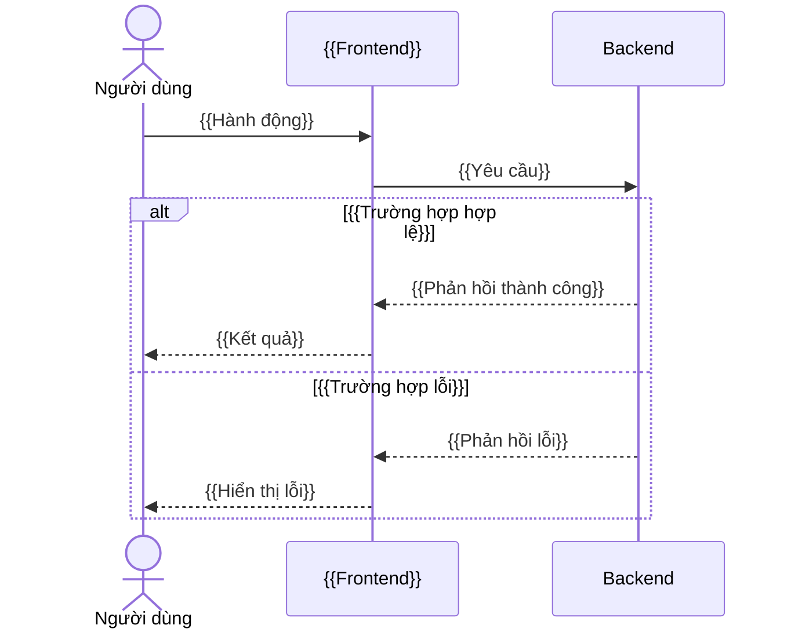

# Gói đặc tả — {{TICKET_ID}} ({{TÊN_CHỨC_NĂNG}})

- **Ticket:** {TICKET_ID}
- **Trạng thái:** Draft
- **Tạo ngày:** {DATE_YYYY_MM_DD} {TIME_HH_MM}
- **Cập nhật ngày:** {DATE_YYYY_MM_DD} {TIME_HH_MM}

> **Nguồn tham chiếu duy nhất cho thay đổi này sau khi được review và các Open Issues P0 được chốt.**
> Không triển khai bất kỳ nội dung nào không được viết ở đây. Các điểm chưa rõ phải được xử lý như Open Issues.

---

## 1. Bối cảnh / Mục đích

Ticket `{{TICKET_ID}}` đặc tả chức năng {{MÔ_TẢ_NGẮN}} theo mô hình:

**{{Mô tả luồng nghiệp vụ tổng quát end-to-end, từ hành động người dùng → xử lý hệ thống → kết quả.}}**

Mục đích nghiệp vụ:

- {{Mục đích 1 — giá trị nghiệp vụ chính.}}
- {{Mục đích 2 — nguồn xác thực/nguồn sự thật của hệ thống.}}
- {{Mục đích 3 — trải nghiệm người dùng kỳ vọng.}}
- {{Mục đích 4 — hành vi khi kết thúc/hủy/hết hạn.}}
- {{Mục đích 5 — khả năng truy vết bằng audit log.}}
- {{Mục đích 6 — ràng buộc “không triển khai ngầm các hành vi chưa phê duyệt”.}}

## 2. Phạm vi

### 2.1 Trong phạm vi

- {{Hạng mục trong phạm vi 1.}}
- {{Hạng mục trong phạm vi 2.}}
- {{… liệt kê đầy đủ các màn hình, luồng, validate, trạng thái, ràng buộc bảo mật, audit nằm trong phạm vi.}}

### 2.2 Ngoài phạm vi

- {{Hạng mục ngoài phạm vi 1 — ví dụ tích hợp bên ngoài.}}
- {{Hạng mục ngoài phạm vi 2 — ví dụ tính năng nâng cao chưa phê duyệt.}}
- {{… bao gồm cả “chi tiết implementation framework, thư viện, schema vật lý, tên bảng, class, package, middleware”.}}

## 3. Thuật ngữ

| #   | Thuật ngữ     | Định nghĩa     |
| --- | ------------- | -------------- |
| 1   | {{Thuật ngữ}} | {{Định nghĩa}} |
| 2   | {{Thuật ngữ}} | {{Định nghĩa}} |
| …   | …             | …              |

| Khái niệm     | Trả lời câu hỏi         | Tác dụng     |
| ------------- | ----------------------- | ------------ |
| {{Khái niệm}} | “{{Câu hỏi nghiệp vụ}}” | {{Tác dụng}} |
| …             | …                       | …            |

## 4. Hiện trạng / Trạng thái mục tiêu

| #   | Khía cạnh     | Hiện trạng     | Trạng thái mục tiêu     |
| --- | ------------- | -------------- | ----------------------- |
| 1   | {{Khía cạnh}} | {{Hiện trạng}} | {{Trạng thái mục tiêu}} |
| …   | …             | …              | …                       |

### 4.1 Cơ chế hiện tại

**Mô tả:** {{Mô tả cơ chế/hành vi hiện tại trước khi Spec Pack này được áp dụng, kèm các rủi ro/khoảng trống nghiệp vụ đang tồn tại.}}

```mermaid
flowchart TD
    A[{{Điểm bắt đầu hiện tại}}] --> B[{{Bước xử lý hiện tại}}]
    B --> C{{{Điều kiện hiện tại?}}}
    C -->|{{Nhánh}}| D[{{Kết quả}}]
    C -->|{{Nhánh khác}}| E[{{Rủi ro nghiệp vụ hiện tại}}]
```

### 4.2 Cải tiến thêm lần này

**Mô tả:** {{Mô tả cơ chế mới mà Spec Pack này chốt lại, nêu rõ nguyên tắc/ràng buộc nghiệp vụ chính thay đổi so với 4.1.}}

```mermaid
flowchart TD
    A[{{Điểm bắt đầu mới}}] --> B[{{Bước xử lý mới}}]
    B --> C{{{Điều kiện mới?}}}
    C -->|{{Nhánh}}| D[{{Kết quả mong muốn}}]
    C -->|{{Nhánh khác}}| E[{{Xử lý ngoại lệ}}]
```

## 5. Chi tiết đặc tả

**Index các sub-section + AC tra cứu:**

| #   | Chủ đề            | Giải thích chức năng                                   | Câu hỏi nghiệp vụ | AC liên quan            | Transitions liên quan |
| --- | ----------------- | ------------------------------------------------------ | ----------------- | ----------------------- | --------------------- |
| 5.1 | {{Chủ đề}}        | {{Giải thích ngắn gọn chức năng của sub-section này.}} | {{Câu hỏi}}       | `AC-{{NHÓM}}-*`         | `T-{{...}}`           |
| 5.2 | State transitions | {{Giải thích ngắn gọn.}}                               | {{Câu hỏi}}       | AC theo từng transition | Tất cả                |
| …   | …                 | …                                                      | …                 | …                       | …                     |

### 5.1 {{Chủ đề sub-section 1}}

**Mục tiêu:** {{Mục tiêu của sub-section.}}

**UI/Wireframe:**

```text
{{ASCII wireframe của màn hình — hoặc N/A nếu không áp dụng.}}
```

| Vùng        | Tên       | Trace     |
| ----------- | --------- | --------- |
| {{Vùng UI}} | {{Mô tả}} | {{AC-ID}} |
| …           | …         | …         |

**UI states cần thiết kế:**

| #   | State     | Ghi chú     |
| --- | --------- | ----------- |
| 1   | {{State}} | {{Ghi chú}} |
| …   | …         | …           |

**Message lỗi cần xử lý:**

| Tình huống     | Message nghiệp vụ |
| -------------- | ----------------- |
| {{Tình huống}} | “{{Message}}”     |
| …              | …                 |

**Luồng end-to-end:**



**Ví dụ:**

- **Happy:** {{Kịch bản thành công.}}
- **Edge:** {{Kịch bản biên.}}
- **Error:** {{Kịch bản lỗi.}}

**OI:** {{Danh sách OI liên quan.}}

### 5.2 State transitions

**Mục tiêu:** {{Tập trung toàn bộ sự kiện gây hệ quả nghiệp vụ.}}

**State diagram:**

```mermaid
stateDiagram-v2
    [*] --> {{StateBanĐầu}}
    {{StateA}} --> {{StateB}}: T-{{TÊN-SỰ-KIỆN}}
    %% {{Bổ sung các transition}}
```

**Bảng state × thuộc tính:**

| State     | Mô tả     | {{Thuộc tính 1?}} | {{Thuộc tính 2?}} | Transitions hợp lệ |
| --------- | --------- | ----------------- | ----------------- | ------------------ |
| {{State}} | {{Mô tả}} | {{Có/Không}}      | {{Có/Không}}      | {{T-...}}          |
| …         | …         | …                 | …                 | …                  |

**Bảng state transition:**

| #   | ID        | Sự kiện     | Mode áp dụng | Hệ quả bắt buộc | Trace     |
| --- | --------- | ----------- | ------------ | --------------- | --------- |
| 1   | T-{{TÊN}} | {{Sự kiện}} | {{Mode}}     | {{Hệ quả}}      | {{AC-ID}} |
| …   | …         | …           | …            | …               | …         |

**UI/Wireframe:** N/A.

**Ví dụ:** N/A; xem các sub-section gọi transition tương ứng.

**OI:** {{Danh sách OI liên quan.}}

### 5.3 {{Chủ đề sub-section 3}}

**Mục tiêu:** {{Mục tiêu.}}

**UI/Wireframe:**

```text
{{Wireframe hoặc N/A.}}
```

**Flow:**

```mermaid
flowchart TD
    A[{{Bắt đầu}}] --> B{{{Điều kiện?}}}
    B -->|Có| C[{{Nhánh đúng}}]
    B -->|Không| D[{{Nhánh sai}}]
```

**UI states cần thiết kế:**

| #   | State     | Ghi chú     |
| --- | --------- | ----------- |
| 1   | {{State}} | {{Ghi chú}} |
| …   | …         | …           |

**Ví dụ:**

- **Happy:** {{...}}
- **Edge:** {{...}}
- **Error:** {{...}}

**OI:** {{...}}

<!-- Lặp lại cấu trúc sub-section (Mục tiêu / UI/Wireframe / states / flow / Ví dụ / OI) cho 5.4, 5.5, … theo nhu cầu ticket. -->

### 5.X Dữ liệu nghiệp vụ và audit

**Mục tiêu:** Mô tả các nhóm dữ liệu nghiệp vụ cần tồn tại để kiểm thử hành vi, không đóng chi tiết schema vật lý.

**Nhóm dữ liệu {{...}}:**

| Trường nghiệp vụ | Mục đích     | Trace     |
| ---------------- | ------------ | --------- |
| {{Trường}}       | {{Mục đích}} | {{AC-ID}} |
| …                | …            | …         |

**Nhóm audit log:**

| Event type | Khi nào ghi       | Kết quả cần truy vết    | Trace     |
| ---------- | ----------------- | ----------------------- | --------- |
| {{Event}}  | {{Điều kiện ghi}} | {{Trường cần truy vết}} | {{AC-ID}} |
| …          | …                 | …                       | …         |

**OI:** {{...}}

## 6. Yêu cầu phi chức năng

| #   | Danh mục                   | Yêu cầu      |
| --- | -------------------------- | ------------ |
| 1   | Hiệu năng                  | {{Yêu cầu.}} |
| 2   | Bảo mật                    | {{Yêu cầu.}} |
| 3   | Tính sẵn sàng              | {{Yêu cầu.}} |
| 4   | Khả năng quan sát          | {{Yêu cầu.}} |
| 5   | Khả năng sử dụng           | {{Yêu cầu.}} |
| 6   | Khả năng kiểm thử          | {{Yêu cầu.}} |
| 7   | Khả năng mở rộng nghiệp vụ | {{Yêu cầu.}} |

## 7. Tiêu chí chấp nhận

### 7.1 {{Nhóm AC 1}} (AC-{{NHÓM}})

| ID               | Mô tả                                         | UT  | IT  | E2E | BB  |
| ---------------- | --------------------------------------------- | --- | --- | --- | --- |
| AC-{{NHÓM}}-1/v1 | {{Mô tả tiêu chí kiểm thử được — Khi… thì….}} | ✓   |     |     | ✓   |
| AC-{{NHÓM}}-2/v1 | {{...}}                                       |     | ✓   | ✓   | ✓   |
| …                | …                                             |     |     |     |     |

<!-- Lặp lại các bảng 7.2, 7.3 … cho từng nhóm AC. -->

### 7.X Không hồi quy (AC-REG)

| ID          | Mô tả                                      | UT  | IT  | E2E | BB  |
| ----------- | ------------------------------------------ | --- | --- | --- | --- |
| AC-REG-1/v1 | {{Hành vi cũ vẫn hoạt động sau thay đổi.}} | ✓   | ✓   | ✓   | ✓   |
| …           | …                                          |     |     |     |     |

## 8. Các vấn đề mở

| #   | ID                   | Câu hỏi                               | Ưu tiên | Người phụ trách | Hạn chót |
| --- | -------------------- | ------------------------------------- | ------- | --------------- | -------- |
| 1   | OI-{{TICKET_ID}}-001 | {{Câu hỏi cần con người quyết định.}} | P0      | {{Vai trò}}     | {{Hạn}}  |
| …   | …                    | …                                     | …       | …               | …        |

## 9. Rủi ro

| #   | Rủi ro     | Khả năng xảy ra         | Mức độ ảnh hưởng        | Biện pháp giảm thiểu |
| --- | ---------- | ----------------------- | ----------------------- | -------------------- |
| 1   | {{Rủi ro}} | {{Thấp/Trung bình/Cao}} | {{Thấp/Trung bình/Cao}} | {{Biện pháp}}        |
| …   | …          | …                       | …                       | …                    |

---

## 10. Bảng truy vết

| #   | AC               | Màn hình/API     | DB         | Logs      | Quyền     | Loại kiểm thử          |
| --- | ---------------- | ---------------- | ---------- | --------- | --------- | ---------------------- |
| 1   | AC-{{NHÓM}}-1/v1 | {{Màn hình/API}} | {{Bảng/—}} | {{Log/—}} | {{Quyền}} | {{UT · IT · E2E · BB}} |
| …   | …                | …                | …          | …         | …         | …                      |

---

## 11. Phán định implementation readiness

**Chỉ với Spec Pack này đã có thể bắt đầu implementation chưa? — {{Yes/No}}.**

Lý do:

- {{Lý do 1 — thường gắn với các OI P0 chưa chốt.}}
- {{Lý do 2.}}
- {{Lý do 3.}}

## 12. Thứ tự ưu tiên Open Issues cần con người quyết định

1. **P0 — OI-{{TICKET_ID}}-00X:** {{Câu hỏi.}}
2. **P0 — OI-{{TICKET_ID}}-00X:** {{Câu hỏi.}}
3. **P1 — OI-{{TICKET_ID}}-00X:** {{Câu hỏi.}}
4. **P2 — OI-{{TICKET_ID}}-00X:** {{Câu hỏi.}}
